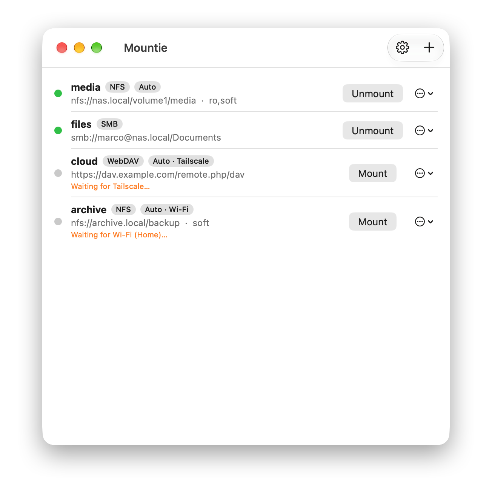
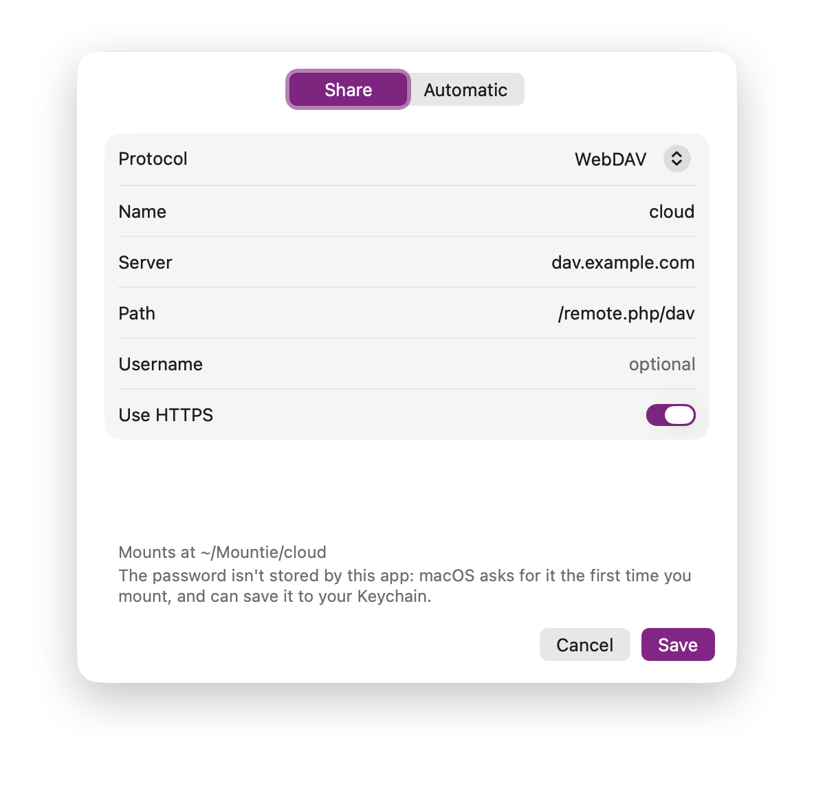
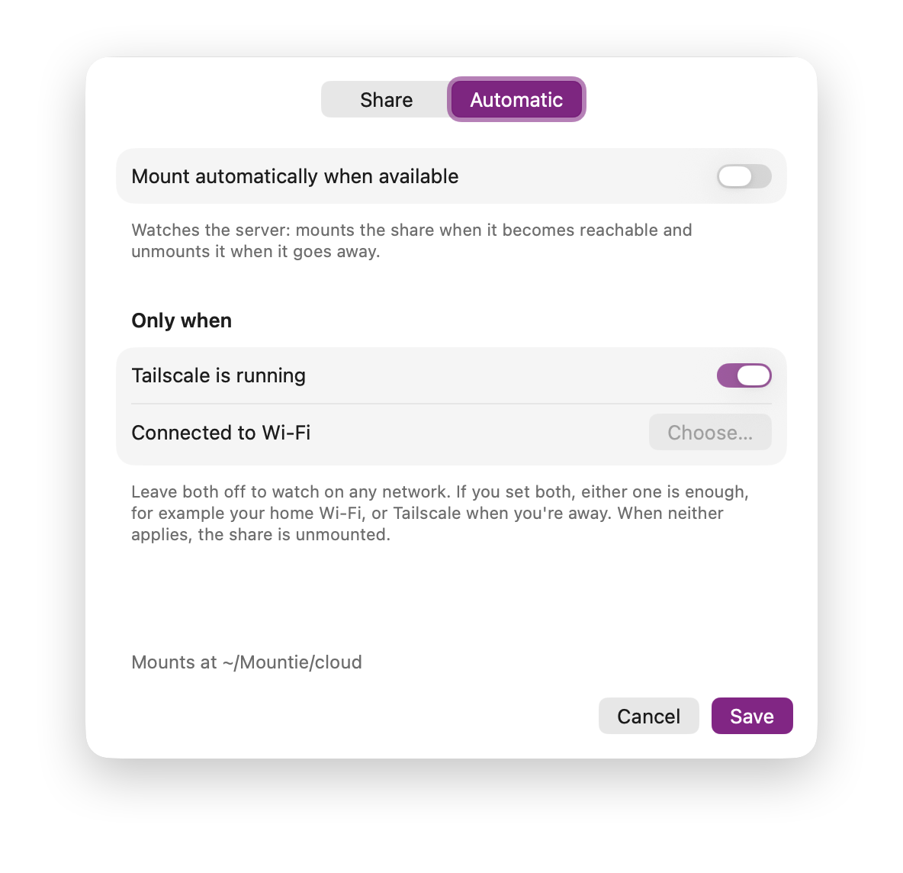
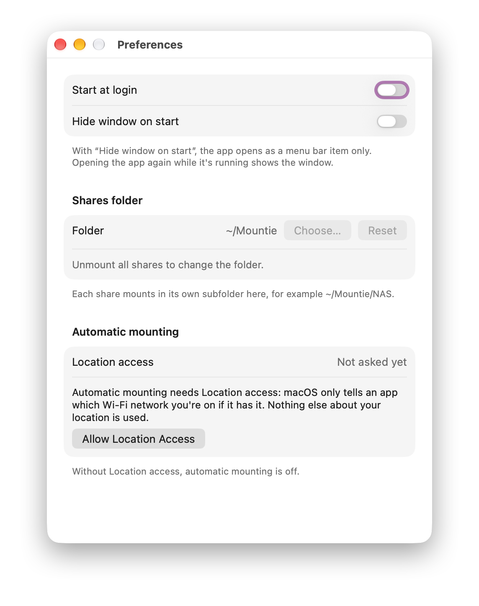

# Mountie

Mount and unmount network shares (NFS, SMB, WebDAV) on macOS from the menu bar or a small window.
No sudo, no admin password.

## Screenshots

| The share list | Adding a share |
|---|---|
|  |  |

| Automatic mounting | Preferences |
|---|---|
|  |  |

## Install

**Download:** get the latest `Mountie-x.y.zip` from the
[releases](https://github.com/marcolaux/mountie-macos/releases) page, unzip it, and drag
Mountie to ~/Applications. Signed with a Developer ID certificate and notarized, so macOS
opens it without warnings.

**Build from source** (requires Xcode or the Command Line Tools; the app runs on macOS 14+):

```sh
./build.sh install        # builds a universal Mountie.app and copies it to ~/Applications
```

Model tests: `./tests/run.sh`. The icon is drawn in code (`icon/make-icon.swift`); `icon/build-icon.sh`
regenerates `icon/AppIcon.icns`. `./build.sh release` builds a Developer ID–signed app for packaging.
The version lives in `VERSION` — the one file to bump when releasing.
`mountiectl` at the repo root is the CLI's source — a zsh script, embedded into the app as-is (no
compile step; `netfsmount.swift` is the one that's compiled, into the SMB/WebDAV helper).

**Releasing** (`./release.sh x.y.z notes-x.y.z.md`): builds and signs, packages the zip, writes the
GitHub release with the notes, and attaches an `appcast.xml` feed so installed apps update themselves
(the release zip is EdDSA-signed for Sparkle by `deps/sparkle-bin/sign_update`; its private key is in
the login keychain and was generated once with `deps/sparkle-bin/generate_keys`, whose printed public
key is pinned as `SPARKLE_PUBKEY` in build.sh).

## Use

**Menu bar:** click the drive icon. Each share is a menu item; a checkmark means mounted, and
clicking toggles it. The icon gets a checkmark badge while anything is mounted.
The menu also has **Manage Shares…**, **Preferences…** and **Check for Updates…**.

**Updating:** release builds update themselves — Mountie checks in the background about once a day
(tunable in the update window), shows the new version with its notes, and installs it on approval.
Dev builds you compile yourself have no updater; the menu item isn't there either.

**Window** (Manage Shares…):

- **Add a share:** click **+**. On the **Share** tab pick a protocol and fill in name, server and path
  (see below). The **Automatic** tab has the auto-mount settings.
- **Actions:** the pill on the share's row holds all of them — mount/unmount, open in Finder,
  edit and remove (right-click works too). Unmount first; editing or removing a mounted share
  is disabled. On a manual mount the folder opens in Finder.
- **Quit unmounts:** quitting Mountie unmounts everything it mounted (on by default; turn it
  off in Preferences if shares should stay mounted). If that takes more than a moment, an
  "Unmounting shares…" dialog with **Cancel** appears. A share that won't unmount — files open
  in another app, a vanished server — brings up a dialog offering **Try Again** (after
  closing whatever holds it), **Force Unmount**, **Keep Mounted**, or **Cancel** (stay
  running); nothing is ever force-unmounted silently. Every unmount attempt, from the menu
  or on quit, is capped at 20 seconds, so a dead server can't hang the app.
- Esc closes the window and Preferences, like ⌘W.
- Shares mount at `<shares folder>/<name>` (default `~/Mountie`, see Preferences) and appear in
  **Finder's sidebar** automatically while mounted, named after the share — and disappear again
  on unmount. Favorites you dragged there yourself are never touched. The volumes themselves are
  mounted hidden (`nobrowse`), so Finder doesn't also list them under Locations under the name
  macOS derives from the address. (A Finder *window* opened on a share still shows that
  server-derived name in its title — that part is macOS's to decide.)
- The first sidebar add makes macOS ask **"Mountie would like to access files on a network
  volume"** once — allow it; the sidebar can't be managed without that permission
  (Privacy & Security → Files and Folders, "Network Volumes").

## Protocols

| Protocol | Server / address | Notes |
|----------|------------------|-------|
| **NFS**  | `nas.example.com` + path `/volume1/media` | Mount options optional (`ro,soft`, …); default `soft`. |
| **SMB**  | `nas.example.com` + share `Documents` (or `Documents/Projects`) | Optional username. |
| **WebDAV** | `dav.example.com` + path `/remote.php/dav` | Optional username; HTTPS on by default. |
| **S3**   | endpoint `s3.us-east-1.amazonaws.com` (leave empty for Amazon S3) + bucket `photos` or `photos/2026` | Keys via the built-in form; see below. |

Not offered: AFP (the client no longer exists in macOS), and SFTP/FTP (macOS has no usable built-in
client; SFTP needs third-party software such as macFUSE).

### S3

macOS has no built-in S3 file system, so Mountie bundles [rclone](https://rclone.org), which serves the
bucket as NFS on `127.0.0.1` — the share is then mounted like a local NFS one, with no FUSE and no
sudo. rclone starts when the share mounts and stops when it unmounts. This is only for S3 shares;
NFS, SMB and WebDAV never involve it.

The **access key ID** and **secret access key** are entered in the share's editor and kept in your
**Keychain** — never in the config file or on disk — and handed to rclone only when mounting or
probing. A **host[:port] endpoint** works for Minio, Wasabi and other S3-compatible services (with
an optional HTTPS toggle for endpoints that aren't encrypted). Automatic mounting treats a bucket as
reachable only when rclone can actually list it, so wrong keys count as "server unavailable" —
add the keys before turning automatic mounting on.

**Passwords.** For SMB and WebDAV the app never sees or stores your password. It mounts through macOS's
NetFS (the same API Finder uses), so macOS shows its usual sign-in dialog the first time and can save the
password to your Keychain (tick "Remember this password"). Automatic mounts never show dialogs; they use
the saved password, and report "Sign-in required" if there isn't one. Mount it once by hand to save it.
S3 has no sign-in dialog; its keys are entered in Mountie's editor and stored in the Keychain directly
(see above). The `mountiectl` command line can't mount S3 shares — the keys live in the app's Keychain.

## Preferences

- **Start at login** – registers the app as a login item. macOS may ask you to approve it in
  System Settings → Login Items.
- **Hide window on start** – the app starts as a menu bar item only. Opening the app again while it's
  running (Finder, Spotlight, Launchpad) shows the window.
- **Shares folder** – where shares are mounted, one subfolder per share (default `~/Mountie`). Pick any
  folder you can write to with **Choose…** (the picker can create one), or **Reset**. It's locked while any
  share is mounted, since moving it would orphan the mount.
- **Automatic mounting** – shows whether Location access has been granted (see below).

## Automatic mounting (per share)

Automatic mounting needs **Location access** (see below). Mountie asks for it when you open a share's
**Automatic** tab; if you don't allow it, automatic mounting is off (the tab's controls are locked, and
shares already set to auto stay as they are, with a note on their row). Once allowed, turn on
**Mount automatically when available**. The app then watches the
server's port (2049 NFS, 445 SMB, 80/443 WebDAV, or the port in the address):

- server becomes reachable → the share is mounted;
- server stops responding (two missed checks in a row) → the share is force-unmounted.

It reacts to *changes*: if you unmount an auto share by hand while its server is up, it stays
unmounted until the server goes away and comes back. Before mounting, the app also checks the share is
actually ready — not just that the port answers: for NFS it asks the server's mountd for its export
list (which mounts nothing), for WebDAV it waits for an HTTP response. A restarting server answers
its port long before its shares will mount, and mounting then only produces I/O errors; the ready
check means the app waits through that window instead of failing. If a mount still fails (e.g. the
export refuses this client, or SMB needs a sign-in), it retries a few times quickly, then
periodically, and shows the error on the row.

**Only when…** limits *where* it applies. Either condition on its own, or both:

- **Tailscale is running** – detected via the Tailscale CLI's `BackendState` (`Tailscale.app`, or
  `tailscale` from Homebrew); if the CLI can't answer, a tunnel interface with a `100.64.0.0/10`
  address. With the condition on, a **Tailscale account** picker appears: restrict the rule to the
  chosen accounts (the profiles set up in the Tailscale app — only one is active at a time, and a
  share usually lives in one tailnet). Leave it at "Any account" for the previous behavior. The
  picker lists the profiles via `tailscale switch --list`, and the watcher compares the active
  tailnet from `tailscale status`; if the CLI can't tell which account is active, a restricted
  share waits rather than mount on a possibly wrong tailnet.
- **Connected to Wi-Fi** – pick from the networks this Mac has already joined (you can't type one in).

With both set, **either one is enough** (say, home Wi-Fi, or Tailscale when you're away). With neither,
the share is watched on any network. When the conditions aren't met the share counts as unavailable, so it
is unmounted and the row says what it's waiting for.

**Location access.** macOS hides the name of the network you're on from apps that don't have Location
access, and the Wi-Fi rules need that name, so Mountie requires it for the whole automatic feature. It's
requested the first time you open the Automatic tab (never at launch) and used for nothing else. If you
decline, or turn it off later in System Settings → Privacy & Security → Location Services, Mountie mounts
and unmounts nothing automatically and says so on the affected rows; manual mounting is unaffected. An
ad-hoc-signed build gets a new identity each time you rebuild it, so macOS may ask again after a rebuild.

A network name isn't proof of where you are (anyone can broadcast the same name), so for shares with
sensitive data rely on the share's own authentication, and pair Wi-Fi rules with Tailscale if you can.
Wired connections have no network name, so they never satisfy a Wi-Fi rule.

Checks run every 10 seconds, and immediately after a network change or wake from sleep.
Change the interval with `defaults write wtf.laux.mountie watchInterval 30`.

Force-unmounting a share whose server has vanished can't flush writes that were still pending.

## Config file

Shares live in `~/Library/Application Support/Mountie/shares.conf` (the shares folder is a preference, not part of this file), which you can also edit by hand:

```
# name   address   [NFS mount options]
media    nfs://nas.example.com/volume1/media               ro,soft
files    smb://alex@nas.example.com/Time%20Machine
cloud    https://dav.example.com/remote.php/dav
```

Every address is a URL; spaces are written `%20`. Saving from the app rewrites the file, so hand-written
comments are not preserved. Names can't contain spaces. Passwords are never written. The auto-mount
settings are stored in the app's preferences (`wtf.laux.mountie`), not in this file, keyed by share name.

## CLI

`Mountie.app/Contents/Resources/mountiectl`:

```
list | mount NAME [quiet] | unmount NAME [force] | toggle NAME | reveal NAME
probe NAME             exit 0 if the server is reachable
ready NAME             exit 0 if the share will mount now — checked without
                       mounting anything (NFS: mountd serves the export list;
                       WebDAV: the server answers HTTP)
tailscale              exit 0 if Tailscale is connected; prints the active tailnet
                       on stdout when the CLI can tell
tailscale-accounts     print the configured profiles as JSON (as the CLI reports them)
config                 print the config path (creating a sample if missing)
```

The command line doesn't manage Finder's sidebar; only the running app does, and it catches up
with any CLI mounts/unmounts within a few seconds.

## Server requirements

NFS exports must allow non-reserved client ports (`insecure` on Linux), because unprivileged mounts
can't use ports below 1024.

## Credits

Mountie is made by Marco Laux and brought to you by [miniml](https://miniml.net).
Questions or feedback: [hi@marcolaux.com](mailto:hi@marcolaux.com).
